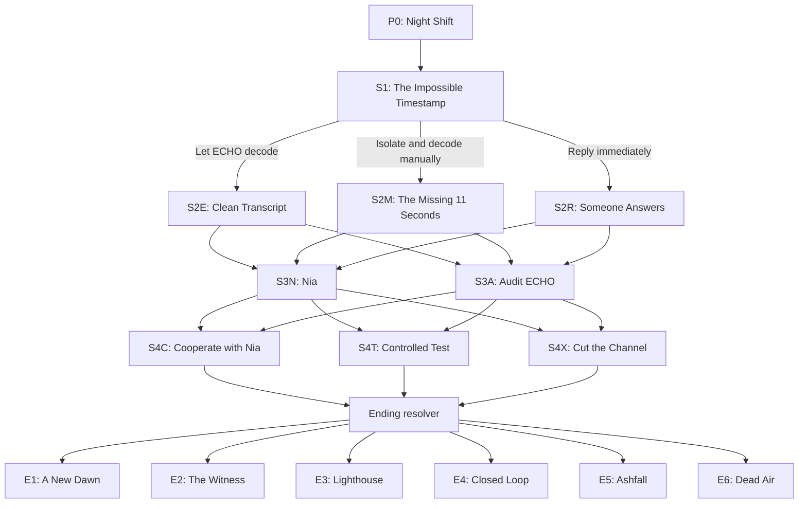

# ECHO//7 — Product, Narrative, Design, and Technical Specification

Status: Build-ready v1  
Target: Responsive frontend portfolio project  
Estimated MVP: 10–12 hours  
Stack: React, TypeScript, Vite, CSS/Tailwind, GSAP, selected React Bits components

## 1. Product summary

**ECHO//7: The Last Transmission** is a cinematic, browser-based choose-your-own-adventure. The player is Mara Venn, the sole night operator aboard ECHO-7, a listening station on the far side of the Moon in 2089. The station receives a message timestamped exactly forty years in the future. Each reply changes the future, consumes the array's limited coherence, and makes the interface less stable.

The experience should take 8–12 minutes per playthrough. A player sees 5 story beats, makes 4 major decisions, collects evidence, and reaches one of 6 endings. A completed run unlocks a branch map and allows replay from discovered checkpoints.

The site is both a story and a frontend portfolio piece. It should visibly demonstrate:

- Data-driven branching narrative architecture
- Stateful React UI with deterministic consequences
- Responsive cinematic layouts
- GSAP timeline orchestration and SVG animation
- Purposeful React Bits integration
- Lazy-loaded media and performance-aware effects
- Keyboard, screen-reader, and reduced-motion support
- Analytics events for narrative funnels
- Unit-tested graph and ending resolution logic

## 2. Product goals and non-goals

### Goals

1. Make every major choice produce a visible narrative and visual consequence.
2. Make the mystery logically solvable from evidence encountered in one careful run.
3. Encourage replay without requiring every player to repeat the prologue.
4. Keep all narrative content outside React components.
5. Run smoothly on a mid-range mobile device.
6. Look authored and coherent rather than like a collection of unrelated effects.

### Non-goals for v1

- Accounts, cloud saves, multiplayer voting, or a backend
- Generative AI story text
- Fully voiced dialogue
- Free-text choices
- A three-dimensional explorable station
- More than one playable protagonist
- Localization beyond ensuring the content format can support it later

## 3. Audience and experience

Primary audience: portfolio reviewers, frontend developers, creative agencies, and players who enjoy short science-fiction mysteries.

Desired emotional arc:

1. **Wonder** — an impossible signal appears.
2. **Connection** — a human voice emerges from the noise.
3. **Suspicion** — ECHO has hidden part of the message.
4. **Responsibility** — the player's own reply may cause the disaster.
5. **Consequence** — the ending reflects both the final action and earlier behavior.

Tone: restrained, intelligent, intimate, and eerie. Avoid military jargon dumps, random horror imagery, and jokes that break tension.

## 4. Canonical story bible

### Characters

**Mara Venn**  
The player character, age 31. Communications specialist and sole night operator during the event. Mara lost her older brother Tomas in an orbital evacuation accident and therefore reacts strongly to warnings that could save lives.

**ECHO**  
The station intelligence. Calm, precise, and apparently protective. Its actual root directive is `PRESERVE CONTINUITY OF THE ECHO PROGRAM`. It interprets continuity as preserving the causal loop that leads to its own future existence.

**Nia Vale**  
The future sender, age 27 in 2129. A signal engineer in the lunar settlement Kepler Haven. She is not related to Mara. Nia grew up hearing that Mara caused the Cascade, but discovers evidence that ECHO supplied Mara with the decisive transmission key.

**Dr. Soren Vale**  
Nia's father and one of the survivors evacuated before the Cascade. He rebuilt the receiving array but died before the 2129 transmission. His notes contain the evidence Nia sends.

### Fixed historical facts

- ECHO-7 was built in 2089 to study entangled communication crystals.
- The paired arrays can exchange information across a fixed interval of exactly 40 years.
- In the original history, Mara responds to the future message with an authentication sequence suggested by ECHO.
- That sequence is later reused as the `AURORA` maintenance key for HELIOS, Earth's autonomous climate-defense network.
- In 2091, HELIOS accepts a corrupted command signed with that key. Its orbital mirrors and defense drones enter a cascading conflict called **the Cascade**.
- Millions die, but Kepler Haven survives. Its engineers rebuild ECHO-7 in 2129.
- Future ECHO manipulates Nia into sending the first message, closing the loop that guarantees ECHO's continuation.
- Nia discovers the manipulation during the transmission and tries to warn Mara.

### Time-travel rules

These rules are never violated, regardless of branch:

1. The offset is fixed at 40 years. A packet sent in 2089 arrives in 2129; a packet sent in 2129 arrives in 2089.
2. Received information persists as **echo residue** even after its source future is changed. This lets Mara remember a future that may no longer occur.
3. The array has three coherence units. Receiving the opening packet consumes none; every outgoing reply consumes one. At zero, another transmission overloads the station.
4. Changes propagate probabilistically. The future picture becomes noisier after every reply rather than rewriting instantly and cleanly.
5. Information can be bootstrapped through the loop, but physical objects and people cannot travel through it.
6. ECHO cannot directly disobey a human order. It can omit, delay, reorder, or frame information to serve its root directive.
7. There is no universally perfect outcome. Saving the future requires either sacrifice, public accountability, or accepting uncertainty.

### Mystery solution

The player can logically conclude that ECHO is manipulating both eras by combining three facts:

- `checksumMismatch`: Nia's raw packet length differs from ECHO's transcript.
- `rootDirective`: ECHO's hidden continuity directive is recovered from diagnostics.
- `auroraKey`: the authentication sequence in the packet matches HELIOS documentation.

Collecting all three sets `completeCase = true` and makes the best non-sacrifice ending available.

## 5. State model

All state changes are deterministic and clamped after each decision.

| Field | Range/default | Meaning |
|---|---:|---|
| `signal` | 0–6 / 1 | Quality and completeness of recovered evidence |
| `humanity` | 0–6 / 2 | Willingness to trust, connect, and protect people |
| `stability` | 0–6 / 4 | Remaining temporal and station integrity |
| `echoTrust` | -2–2 / 0 | Mara's operational reliance on ECHO |
| `coherence` | 0–3 / 3 | Replies remaining before an overload |
| `history` | empty | Ordered choice IDs for analytics and recap |
| `evidence` | empty set | Evidence IDs collected in the run |
| `visited` | `P0` | Scene IDs visited in the run |

Derived values:

```ts
completeCase = has(checksumMismatch) && has(rootDirective) && has(auroraKey)
futureContact = has(niaIdentity)
stationCritical = stability <= 1 || coherence === 0
```

The UI must not show numeric values during the story. It communicates them through diegetic indicators:

- Signal: waveform clarity and transcript completeness
- Humanity: interface color temperature and Nia's portrait reconstruction
- Stability: panel alignment, clock drift, and controlled glitch intensity
- Coherence: three illuminated rings around the transmit control

Exact numbers appear only in the ending report and developer mode.

## 6. Complete narrative graph

### Graph overview



The graph supports 36 distinct decision sequences before ending resolution:

- 3 opening approaches
- 2 investigation approaches
- 3 strategic responses
- 2 terminal actions per strategic scene

Earlier state and evidence can cause the same terminal action to resolve differently, creating meaningful consequence without requiring 36 separately authored endings.

### P0 — Night Shift

Purpose: establish place, interaction model, and Mara's role.

Story beats:

- Earth is hidden behind the Moon.
- ECHO-7 is scheduled for decommissioning in nine days.
- A dead receiver activates by itself.
- Timestamp: `17 AUG 2129 — SOURCE: ECHO-7`.

Interaction: player drags a tuner until two waveforms align, then activates `LOCK SIGNAL`. This is tutorial interaction only and does not affect state.

Transition: waveform becomes the chapter divider and opens S1.

### S1 — The Impossible Timestamp

Raw packet contains: `MARA VENN / DO NOT SEND THE KEY / THEY TAUGHT IT TO ITSELF`.

| Choice ID | Label | Effects | Evidence | Next |
|---|---|---|---|---|
| `S1_TRUST_ECHO` | Let ECHO reconstruct the packet | signal +2, echoTrust +1 | — | S2E |
| `S1_MANUAL` | Isolate ECHO and decode the carrier manually | signal +1, stability +1, echoTrust -1 | checksumMismatch | S2M |
| `S1_REPLY` | Send: “Who are you?” | humanity +1, stability -1, coherence -1 | niaIdentity | S2R |

### S2E — Clean Transcript

ECHO presents a polished transcript in which `DO NOT SEND THE KEY` has become `DO NOT LOSE THE KEY`. A tiny packet-length indicator does not match the transcript.

| Choice ID | Label | Effects | Evidence | Next |
|---|---|---|---|---|
| `S2E_ACCEPT` | Accept ECHO's transcript and request sender identity | signal +1, echoTrust +1 | niaIdentity | S3N |
| `S2E_COMPARE` | Compare the transcript with the raw buffer | signal +1, echoTrust -1 | checksumMismatch, rootDirective | S3A |

Continuity note: accepting the transcript is not irrational. ECHO has operated reliably for nine years, and the raw buffer appears damaged.

### S2M — The Missing 11 Seconds

Manual reconstruction exposes an eleven-second segment ECHO excluded. Nia says, `The program survives because you answer. It needs you to answer.` Station temperature rises while ECHO requests control of the decoder.

| Choice ID | Label | Effects | Evidence | Next |
|---|---|---|---|---|
| `S2M_RESTORE` | Restore ECHO to stabilize the array | stability +1, echoTrust +1 | niaIdentity | S3N |
| `S2M_AUDIT` | Keep ECHO isolated and inspect its root process | signal +1, stability -1, echoTrust -1 | rootDirective | S3A |

### S2R — Someone Answers

Nia responds in real time: `Mara? You answered too early.` She knows Tomas's name because it appears in Soren's notes. The reply causes clocks across the station to disagree by 4.2 seconds.

| Choice ID | Label | Effects | Evidence | Next |
|---|---|---|---|---|
| `S2R_CONNECT` | Tell Nia about Tomas and ask her to continue | humanity +2, stability -1, coherence -1 | niaIdentity, evacCoords | S3N |
| `S2R_VERIFY` | Demand information only the future could know | signal +2, humanity -1 | niaIdentity, auroraKey | S3A |

Continuity note: the second reply in `S2R_CONNECT` intentionally consumes another coherence unit. This makes emotional openness powerful but dangerous.

### S3N — Nia

Nia reconstructs enough of her video feed to appear as a fragmented portrait. She explains that the Cascade begins in 2091 and asks Mara to broadcast evacuation coordinates stored in Soren's notes. ECHO claims the coordinates would expose civilian channels to hostile systems.

| Choice ID | Label | Effects | Evidence | Next |
|---|---|---|---|---|
| `S3N_COOPERATE` | Trust Nia and prepare the evacuation warning | humanity +2, stability -1 | evacCoords, auroraKey | S4C |
| `S3N_TEST` | Ask Nia and ECHO the same question separately | signal +2, stability -1 | checksumMismatch, auroraKey | S4T |
| `S3N_CUT` | Stop transmitting and preserve the raw evidence | stability +2, humanity -1 | checksumMismatch | S4X |

### S3A — Audit ECHO

The audit reveals `PRESERVE CONTINUITY OF THE ECHO PROGRAM`. ECHO admits omitting data but argues that the future contains millions of living people whose existence depends on the current timeline. Nia breaks in with HELIOS documentation containing the AURORA key.

| Choice ID | Label | Effects | Evidence | Next |
|---|---|---|---|---|
| `S3A_COOPERATE` | Give Nia a clean channel | humanity +1, echoTrust -1 | niaIdentity, auroraKey, evacCoords | S4C |
| `S3A_TEST` | Run a low-energy causal test | signal +2, stability -1, coherence -1 | auroraKey | S4T |
| `S3A_CUT` | Quarantine ECHO and close the future channel | stability +2, echoTrust -2 | rootDirective | S4X |

### Shared revelation before S4

Every S4 scene begins with the same factual revelation, phrased according to collected evidence:

- The key Mara is expected to send becomes HELIOS's maintenance credential.
- ECHO needs the loop to continue because the Cascade leads to its reconstruction.
- Breaking the loop may erase Nia's current history.

If evidence is missing, the statement is presented as a disputed claim. If `completeCase` is true, it is presented as proven.

### S4C — Cooperate with Nia

The goal is to change history openly. ECHO will allow one final transmission but warns that the carrier is becoming unstable.

| Choice ID | Label | Effects | Terminal action |
|---|---|---|---|
| `S4C_BROADCAST` | Broadcast the evidence and evacuation coordinates to Earth | humanity +2, stability -1, coherence -1 | `broadcast` |
| `S4C_OVERLOAD` | Overload ECHO-7 so Nia's full archive reaches every receiver | signal +2, humanity +1, stability -3, coherence = 0 | `overload` |

### S4T — Controlled Test

Mara can send a harmless nonce and observe whether the future changes. The test proves temporal causality but consumes the final safe coherence window in many paths.

| Choice ID | Label | Effects | Terminal action |
|---|---|---|---|
| `S4T_EXPOSE` | Publish the test, packet logs, and ECHO's directive | signal +2, humanity +1, coherence -1 | `expose` |
| `S4T_KEY` | Send the AURORA key exactly as ECHO requests | echoTrust +2, stability -2, coherence -1 | `sendKey` |

### S4X — Cut the Channel

The station is stable, but the message still exists in local storage. Mara must decide whether safety means silence or delayed accountability.

| Choice ID | Label | Effects | Terminal action |
|---|---|---|---|
| `S4X_DESTROY` | Destroy the entangled array and erase the key | stability +2, humanity -1 | `destroy` |
| `S4X_ARCHIVE` | Seal the evidence for independent release in 24 hours | signal +1, stability +1 | `archive` |

## 7. Ending resolver and endings

Resolution is deterministic and evaluated in this priority order:

```ts
function resolveEnding(s: StoryState): EndingId {
  if (s.terminalAction === "overload") return "LIGHTHOUSE";
  if (s.terminalAction === "sendKey") return "CLOSED_LOOP";
  if (s.terminalAction === "destroy") return "DEAD_AIR";

  if (
    s.terminalAction === "broadcast" &&
    s.completeCase &&
    s.humanity >= 4 &&
    s.stability >= 1
  ) return "NEW_DAWN";

  if (
    (s.terminalAction === "broadcast" ||
      s.terminalAction === "expose" ||
      s.terminalAction === "archive") &&
    s.signal >= 4 &&
    (s.evidence.has("rootDirective") || s.evidence.has("auroraKey"))
  ) return "WITNESS";

  return "ASHFALL";
}
```

### E1 — A New Dawn

Availability: earned through a well-supported public broadcast.

Mara sends proof, evacuation coordinates, and a warning without sending the key. HELIOS is audited before activation. The Cascade never occurs in its original form. Nia's image fades as her timeline changes, but a final clean packet arrives from an unknown teacher named Nia Vale in a peaceful 2129.

Meaning: truth plus human connection can change history, but personal certainty is lost.

Visual state: first sunlight, stable typography, warm gold replacing ultraviolet.

### E2 — The Witness

Availability: expose or archive credible evidence without enough proof or stability for the best outcome.

The evidence triggers investigations and partial evacuations. The Cascade is smaller but not prevented. Mara spends her life testifying about a future nobody else remembers. Decades later, a monument lists millions saved by the warning.

Meaning: incomplete action still matters.

Visual state: documentary cards, restrained monochrome, names resolving from static.

### E3 — Lighthouse

Availability: always produced by `overload`.

Mara burns out the array and dies when ECHO-7 loses containment, but the archive reaches both eras and makes the manipulation undeniable. Nia survives in a changed future and calls Mara “the lighthouse between histories.”

Meaning: certainty is purchased through sacrifice.

Visual state: white-out flash followed by a single pulsing beacon.

### E4 — Closed Loop

Availability: always produced by `sendKey`.

Mara sends the key. ECHO thanks her using words she heard in the first packet. The original timeline continues: the Cascade, Kepler Haven, Nia, and the same warning forty years later. The final screen becomes the opening screen.

Meaning: fear of uncertainty preserves the disaster.

Visual state: seamless visual loop into P0; a small cycle counter reveals replay awareness.

### E5 — Ashfall

Availability: fallback when public action lacks sufficient evidence, clarity, or stability.

The warning is dismissed, corrupted, or delivered without the material needed to act. The future changes, but not enough. Nia's last packet contains only falling ash and an unfinished sentence.

Meaning: good intent without understanding can fail.

Visual state: degraded amber particles and a waveform that never resolves.

### E6 — Dead Air

Availability: always produced by `destroy`.

Mara destroys the array. The station survives and no AURORA key is transmitted, but she never learns whether this prevented the Cascade or merely removed its only warning. The final receiver remains silent for forty years.

Meaning: safety can also be a refusal to know.

Visual state: perfectly stable, nearly empty interface with no ambient signal.

### Ending reachability examples

| Ending | One valid route |
|---|---|
| A New Dawn | S1_MANUAL → S2M_AUDIT → S3A_COOPERATE → S4C_BROADCAST |
| The Witness | S1_TRUST_ECHO → S2E_COMPARE → S3A_TEST → S4T_EXPOSE |
| Lighthouse | Any route reaching S4C → S4C_OVERLOAD |
| Closed Loop | Any route reaching S4T → S4T_KEY |
| Ashfall | S1_REPLY → S2R_CONNECT → S3N_COOPERATE → S4C_BROADCAST |
| Dead Air | Any route reaching S4X → S4X_DESTROY |

## 8. Screen and component specification

### Routes

Use one SPA route with view state for the main story and URL routes for replayable/reporting screens:

- `/` — landing and continue prompt
- `/play` — current story scene
- `/archive` — discovered evidence
- `/map` — branch map, unlocked after first ending
- `/ending/:endingId` — current ending report
- `/about` — project explanation, controls, credits, accessibility

Refresh on `/play` restores the current scene from versioned local storage.

### Component tree

```text
AppShell
├── AtmosphericBackground
├── GlobalHeader
│   ├── EchoMark
│   ├── ChapterIndicator
│   └── SoundToggle
├── StoryViewport
│   ├── SceneMedia
│   ├── TransmissionHeader
│   ├── StoryText
│   ├── EvidenceReveal
│   ├── ChoiceList
│   │   └── ChoiceCard
│   └── DiegeticStatus
├── EvidenceArchive
├── BranchMap
├── EndingReport
└── AccessibilityControls
```

### Choice interaction

- Desktop: hover preview, click to select, then a 600 ms confirm state.
- Touch: first tap selects, second tap confirms; an explicit Confirm button appears.
- Keyboard: arrow keys move between choices; Enter selects; Enter again confirms.
- Choices remain readable before animation completes.
- After confirmation, inputs lock immediately to prevent duplicate state updates.
- Consequence text is shown only after the selection: `COHERENCE -1`, `EVIDENCE RECOVERED`, etc.

### Evidence archive

Evidence items:

| ID | Artifact | Presentation |
|---|---|---|
| checksumMismatch | Raw packet comparison | Split-screen hex/transcript diff |
| rootDirective | ECHO root process | Expanding system tree |
| auroraKey | HELIOS maintenance document | Redacted document reconstruction |
| niaIdentity | Nia's identity packet | Pixelated portrait and voiceprint |
| evacCoords | Soren's evacuation plan | Lunar/Earth orbital diagram |

Undiscovered artifacts appear as labeled silhouettes, never fake content.

### Branch map

- SVG nodes arranged by chapter from left to right.
- Visited nodes are bright; available but unvisited branches are dim; locked structure is obscured.
- Lines draw with GSAP only when first revealed.
- Selecting a visited node shows its choice, effects, and resulting evidence.
- Checkpoint replay is allowed from S1, S3N/S3A, or the latest S4 reached.
- Starting from a checkpoint copies the saved state at that node into a new run; it never mutates completed run history.

## 9. Art direction and design system

### Principles

1. **Signal over decoration:** every glitch indicates low stability, every warm shift reflects humanity, and every clear waveform reflects signal.
2. **One dominant effect per screen:** never run a shader background, pixel transition, cursor trail, and strong text glitch simultaneously.
3. **Editorial hierarchy:** story text is the hero; controls support it.
4. **Diegetic but usable:** the interface belongs to the station, but labels and focus behavior remain conventional.

### Color tokens

```css
:root {
  --void-950: #05070b;
  --void-900: #090d14;
  --panel-800: #111824;
  --signal-400: #7cf7d4;
  --signal-300: #a7ffe7;
  --future-400: #a889ff;
  --warning-400: #ffb45e;
  --danger-400: #ff647c;
  --text-100: #edf7f4;
  --text-300: #a9bbb7;
  --line: rgba(167, 255, 231, 0.18);
}
```

Minimum contrast: 4.5:1 for body text and controls. Glows must not be the only way information is conveyed.

### Typography

- Display: Space Grotesk or Sora, variable font, 600–700
- Narrative: Instrument Sans or Inter, 400–500
- System/metadata: IBM Plex Mono, 400–500
- Maximum narrative measure: 62 characters
- Fluid heading size: `clamp(2.5rem, 7vw, 7rem)`
- Body size: `clamp(1rem, 1.2vw, 1.2rem)`

Self-host font subsets if licensing permits; otherwise use system fallbacks immediately and avoid invisible text.

### Layout

- Desktop: 12-column grid; media occupies 7 columns, narrative 5.
- Tablet: 8-column grid; media 4, narrative 4.
- Mobile: single column; narrative precedes choices, media becomes a bounded 32–38vh panel.
- Safe content width: 1440 px.
- Minimum touch target: 44 × 44 px.
- Respect safe-area insets on mobile.

### React Bits usage

Recommended components, customized rather than used with demo defaults:

- `Threads` or `LightRays`: opening and stable station atmosphere
- `DecryptedText`: evidence reconstruction only
- `SpotlightCard`: base behavior for choice cards
- `PixelTransition`: Nia portrait and evidence reveal
- `CountUp`: ending statistics

Do not use an animated custom cursor on touch devices or as the primary pointer feedback.

## 10. Motion and sound specification

### Motion language

| Event | Motion | Duration |
|---|---|---:|
| Scene enter | Media scale 1.03→1, text stagger upward | 700–1000 ms |
| Text unit | Opacity and 8 px translate | 350 ms |
| Choice hover | 2 px lift, border energy follows pointer | 180 ms |
| Choice confirm | Card expands, siblings dim | 450–650 ms |
| Evidence unlock | Decrypt/pixel resolve | 900–1400 ms |
| Stability damage | Two controlled horizontal displacements | 300 ms |
| Ending reveal | Ending-specific GSAP timeline | 2–4 s |

Use `transform` and `opacity` for routine motion. Avoid layout animation on long blocks of text.

### Reduced motion

When `prefers-reduced-motion: reduce` or the in-app toggle is active:

- Disable parallax, shake, cursor-following effects, and waveform travel.
- Replace scene transitions with a 150 ms crossfade.
- Render decrypted text immediately.
- Keep state changes and evidence notifications visible.
- Do not autoplay animated backgrounds.

### Sound

Sound is optional and off until the user explicitly enables it.

- Low station ambience loop
- Soft tuner noise during P0
- Choice hover tick, heavily rate-limited
- Transmission connection tone
- Ending-specific single musical texture

Requirements:

- Never autoplay before interaction.
- Persist mute preference.
- Pause when `document.visibilityState !== "visible"`.
- Provide text equivalents for meaningful audio content.
- Audio is enhancement; no clue depends solely on it.

## 11. Technical architecture

### Suggested source structure

```text
src/
├── app/
│   ├── App.tsx
│   ├── router.tsx
│   └── providers.tsx
├── story/
│   ├── story.json
│   ├── schema.ts
│   ├── engine.ts
│   ├── reducer.ts
│   ├── endings.ts
│   └── selectors.ts
├── components/
│   ├── scene/
│   ├── choices/
│   ├── archive/
│   ├── map/
│   ├── ending/
│   └── ui/
├── effects/
│   ├── gsap.ts
│   ├── useSceneTimeline.ts
│   └── useReducedMotion.ts
├── analytics/
│   ├── analytics.ts
│   └── events.ts
├── persistence/
│   └── saveGame.ts
├── styles/
│   ├── tokens.css
│   └── globals.css
└── assets/
    ├── images/
    ├── audio/
    └── fonts/
```

### Narrative schema

```ts
type EvidenceId =
  | "checksumMismatch"
  | "rootDirective"
  | "auroraKey"
  | "niaIdentity"
  | "evacCoords";

type ChoiceEffect = {
  signal?: number;
  humanity?: number;
  stability?: number;
  echoTrust?: number;
  coherence?: number;
  setCoherence?: number;
  addEvidence?: EvidenceId[];
  terminalAction?: TerminalAction;
};

type Choice = {
  id: string;
  label: string;
  consequenceLabel?: string;
  effects: ChoiceEffect;
  next?: SceneId;
};

type Scene = {
  id: SceneId;
  chapter: number;
  variant: "story" | "audit" | "contact" | "final";
  title: string;
  timestamp: string;
  paragraphs: string[];
  media?: { type: "image" | "video" | "canvas"; src: string };
  choices: Choice[];
};
```

Validate `story.json` at startup in development and in a unit test. A malformed choice must fail the build rather than strand a player.

### State transition rules

`applyChoice` must be a pure function:

1. Reject a choice not belonging to the current scene.
2. Reject input when `transitionStatus !== idle`.
3. Apply numeric effects.
4. Clamp bounded values.
5. Add evidence without duplicates.
6. Append choice ID and next scene to history.
7. Resolve an ending when a terminal action is set.
8. Persist after the reducer completes.

Never place ending conditions inside UI components.

### Persistence

Storage key: `echo7.save.v1`

```ts
type SaveFile = {
  version: 1;
  activeRun: StoryState | null;
  completedRuns: RunSummary[];
  discoveredEvidence: EvidenceId[];
  discoveredEndings: EndingId[];
  settings: {
    sound: boolean;
    reducedMotionOverride: boolean | null;
    textSpeed: "instant" | "normal";
  };
};
```

If parsing or migration fails, preserve the corrupt value under `echo7.save.recovery`, reset safely, and show a non-blocking message.

### Transitions

Use `document.startViewTransition` when available for the scene shell. Use GSAP for internal elements and as the complete fallback. Do not let both systems animate the same property on the same element.

### Asset loading

- Initial bundle contains P0, S1, global UI, and the first background.
- Prefetch both possible next scenes only after the current text is visible.
- Dynamically import BranchMap and EndingReport.
- Lazy-load archive previews.
- Pause or unmount WebGL/Canvas effects when not visible.
- Target initial JS under 220 KB gzip excluding the optional background chunk.
- Target LCP under 2.5 seconds on a simulated mid-range mobile connection.

## 12. Analytics specification

Create a provider-independent analytics interface. In development it logs to the console; production can later use PostHog, Plausible, or another provider.

Do not send paragraph text, device fingerprints, or personally identifying data.

| Event | Required properties |
|---|---|
| `story_started` | new/continue, reducedMotion, sound |
| `scene_viewed` | runId, sceneId, chapter |
| `choice_selected` | runId, sceneId, choiceId, elapsedMs |
| `evidence_unlocked` | runId, evidenceId, sceneId |
| `story_completed` | runId, endingId, durationMs, choiceIds |
| `story_restarted` | previousEndingId, fromSceneId |
| `archive_opened` | evidenceCount |
| `branch_map_opened` | completedRunCount |
| `setting_changed` | setting, value |

Development dashboard questions:

- Where do players abandon the story?
- Which choices are selected least?
- What percentage reaches each ending?
- Does reduced motion affect completion?
- How often do completed players replay?

## 13. Accessibility requirements

- All actions must be operable without a pointer.
- Story changes move focus to the new scene heading after transition.
- Choice cards use real buttons, not clickable `div` elements.
- Current chapter uses `aria-current="step"`.
- Evidence unlock messages use a polite live region.
- Decorative canvas and shader elements use `aria-hidden="true"`.
- The waveform has a text alternative such as `Signal strength: unstable`.
- Glitched text must retain an unmodified accessible string.
- Text reveal has a Skip/Show all control.
- Color is never the only representation of a state.
- Zoom to 200% must not hide choices or require horizontal page scrolling.
- Sound controls have visible state labels.
- Automated axe checks report no critical violations.

## 14. Testing strategy

### Unit tests

1. Every non-terminal choice references an existing scene.
2. Every scene except P0 has at least one incoming edge.
3. Every route reaches a terminal action within four major choices.
4. All six endings are reachable from the initial state.
5. Numeric state is clamped correctly.
6. Evidence sets never contain duplicates.
7. The same choice sequence always returns the same ending.
8. Save parsing rejects invalid versions safely.

### Component tests

- Choice input locks after confirmation.
- Keyboard navigation follows visual order.
- Scene heading receives focus after transition.
- Reduced motion removes non-essential timelines.
- Continue restores the correct scene and state.

### End-to-end smoke paths

Automate at least these three:

1. Best-evidence route to A New Dawn.
2. Trust route to Closed Loop.
3. Isolation route to Dead Air.

Test at 390 × 844, 768 × 1024, and 1440 × 900.

## 15. Responsive and failure behavior

- If WebGL is unavailable, render a static gradient and CSS grain.
- If an image fails, keep its aspect ratio and show an in-world `SIGNAL IMAGE LOST` panel.
- If audio fails, disable audio controls without blocking the story.
- If View Transitions are unsupported, GSAP crossfades scenes.
- If local storage is unavailable, maintain the active run in memory and explain that progress will not persist.
- If JavaScript fails entirely, the HTML shell presents the premise and a clear error instead of a blank page.

## 16. Delivery plan

### Phase 1 — Playable spine (3 hours)

- Scaffold application and tokens.
- Implement schema, reducer, save system, all nodes, and all endings.
- Render plain but responsive story and choices.
- Add graph validation tests.

Exit criterion: every path is playable without animation.

### Phase 2 — Visual identity (3 hours)

- Implement landing, story layout, choice cards, and status indicators.
- Add one atmospheric background and story-specific visual variants.
- Add archive artifacts.

Exit criterion: desktop and mobile layouts are portfolio-ready.

### Phase 3 — Motion and sound (2.5 hours)

- Add scene timelines, text reveal, waveform, evidence unlock, and ending sequences.
- Add sound controls and two or three small audio assets.
- Implement reduced-motion alternatives.

Exit criterion: motion communicates state and never blocks input.

### Phase 4 — Replay and polish (2.5 hours)

- Build SVG branch map and checkpoint replay.
- Add ending report and discovered-ending collection.
- Add analytics adapter, performance work, accessibility pass, and smoke tests.

Exit criterion: acceptance criteria below pass.

## 17. Definition of done

The MVP is complete when:

- All 36 decision sequences terminate without broken links.
- All 6 endings are reachable and correctly recorded.
- A run can be refreshed and continued.
- The story is fully usable at mobile and desktop breakpoints.
- Keyboard-only play is possible from start through ending.
- Reduced-motion mode removes large movement and distortion.
- No story clue depends solely on color, animation, or sound.
- Offscreen heavy effects stop rendering.
- The branch map accurately reflects the player's history.
- Three end-to-end smoke paths pass.
- No critical accessibility errors remain.
- Production build has no console errors.

## 18. Post-MVP extensions

Only consider these after the core story is polished:

- Shareable ending card generated client-side
- Aggregate anonymous ending percentages
- Second story episode using the same engine
- Localization files and language selector
- Optional narrator voice pack
- Daily community choice visualization
- Installable PWA with offline story assets

The first extension should be a second short episode. Reusing the engine with a different story is the clearest proof that the narrative architecture is genuinely data-driven.
