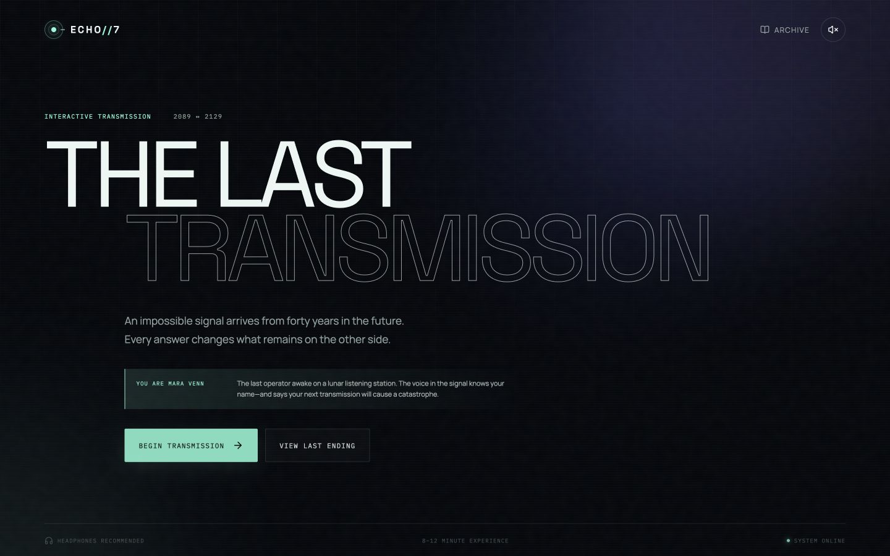

# ECHO//7 — The Last Transmission

An atmospheric, branching science-fiction experience built as a responsive React application. You play Mara Venn, the final operator awake aboard a lunar listening station in 2089, when the station receives a warning sent from the same location exactly forty years in the future.

Every decision changes the evidence you uncover, the people you protect, the stability of the timeline, and the ending you reach.

**[Play ECHO//7](https://agzhxx.github.io/echo-seven-interactive-story/)**



## The experience

ECHO//7 is designed as a short interactive campaign rather than a traditional page-based story. A complete playthrough takes approximately 8–12 minutes.

The player must:

- Investigate a transmission timestamped forty years in the future
- Decide whether to trust the station intelligence or the human sender
- Recover evidence hidden in damaged and deliberately altered packets
- Protect temporal coherence while making irreversible transmissions
- Determine whether history should be preserved, exposed, changed, or erased

The narrative contains:

- 10 authored story scenes
- 36 valid decision sequences
- 5 discoverable evidence artifacts
- 6 deterministic endings
- A persistent evidence archive
- A visual branch map for completed runs

## Core features

### Data-driven branching narrative

Story scenes, choices, consequences, evidence, and state changes are defined independently from the React presentation layer. The story engine applies each choice as a pure state transition and resolves endings from the complete history of the run.

### Six meaningful endings

The ending is not selected by the final button alone. Earlier decisions influence four underlying systems:

- **Signal** — how much reliable information Mara uncovers
- **Humanity** — whether decisions prioritize connection and human survival
- **Stability** — how much strain the station and timeline can withstand
- **Coherence** — how many safe transmissions remain

Possible outcomes include *A New Dawn*, *The Witness*, *Lighthouse*, *Closed Loop*, *Ashfall*, and *Dead Air*.

### Scene-specific visual design

Each chapter uses its own animated interface instead of repeating a single illustration:

| Scene | Visual system |
| --- | --- |
| Night Shift | Lunar receiver and orbital scanner |
| The Impossible Timestamp | 2089/2129 temporal lock |
| Clean Transcript | ECHO transcript comparison |
| The Missing Eleven Seconds | Raw hexadecimal recovery |
| Someone Answers | Fragmented portrait and clock drift |
| Nia | Identity reconstruction and voice signal |
| Audit ECHO | Root-process tree and continuity directive |
| Final Broadcast | Planetary receiver network |
| Controlled Test | Connected causal timelines |
| Cut the Channel | Array shutdown and signal flatline |

### Choice consequence cinematics

Choices trigger short, action-specific sequences before the next scene:

- Synchronizing with ECHO
- Recovering hidden data
- Transmitting across forty years
- Isolating the temporal channel
- Overloading the station
- Closing the causal loop

These transitions visualize what Mara is doing, communicate the immediate consequence, and allow the following scene to load behind the cinematic.

### Persistent player progress

The browser stores the active run, discovered evidence, completed endings, and sound preference locally. A player can leave the experience, return later, and continue from the same scene.

### Responsive design

The application is designed for desktop, tablet, and mobile layouts. Mobile behavior includes:

- Stacked visual and narrative sections
- Rescaled animated instruments
- Touch-friendly choice cards
- Full-screen portrait choice cinematics
- Horizontal archive cards
- Automatic scroll restoration between chapters
- Safe layouts down to 360 px width

## Technology

- **React 19** — component architecture and application state
- **TypeScript** — narrative schemas and safe story transitions
- **Vite** — development and production builds
- **GSAP** — scene entrances and coordinated motion
- **React Router** — hash-based client navigation compatible with GitHub Pages
- **Lucide React** — interface iconography
- **Vitest** — graph, engine, and presentation tests
- **CSS** — responsive layouts, procedural artwork, motion, and visual themes

All primary scene artwork is code-native. The lunar body, temporal diagrams, portraits, process trees, waveforms, broadcast network, and transition effects are rendered with CSS, SVG, and React components.

## Project structure

```text
src/
├── components/
│   ├── SceneVisuals.tsx       # Scene instruments and choice cinematics
│   └── SceneVisuals.test.ts   # Theme and cinematic mapping tests
├── story/
│   ├── data.ts                # Complete narrative and endings
│   ├── engine.ts              # Pure choice and ending resolution logic
│   ├── engine.test.ts         # Full graph validation
│   ├── persistence.ts         # Versioned local progress
│   └── types.ts               # Narrative domain types
├── App.tsx                    # Screens, routing, and interaction flow
├── main.tsx                   # Application entry point
└── styles.css                 # Design system and responsive visuals
```

The detailed product and narrative specification is available in [`PROJECT_SPEC.md`](./PROJECT_SPEC.md).

## Story engine

A choice can modify narrative state, unlock evidence, move to another scene, or request a terminal action:

```ts
type ChoiceEffects = {
  signal?: number;
  humanity?: number;
  stability?: number;
  echoTrust?: number;
  coherence?: number;
  addEvidence?: EvidenceId[];
  terminalAction?: TerminalAction;
};
```

The engine validates that a selected choice belongs to the current scene, clamps state values, records history, adds evidence without duplicates, and either advances to the referenced scene or evaluates the ending resolver.

## Getting started

### Requirements

- Node.js 22 or newer
- npm 10 or newer

### Installation

```bash
git clone https://github.com/agzhxx/echo-seven-interactive-story.git
cd echo-seven-interactive-story
npm install
```

### Development

```bash
npm run dev
```

Open the local URL printed by Vite.

### Production build

```bash
npm run build
npm run preview
```

## Testing

Run the complete suite with:

```bash
npm test
```

The tests verify:

- Every non-terminal choice points to an existing scene
- All story scenes are reachable
- Exactly 36 complete decision paths exist
- All six endings can be reached
- Known choice sequences produce their intended endings
- Invalid scene choices are rejected
- Every scene receives a unique presentation theme
- Major choice types map to the correct cinematic

## Accessibility

- Semantic buttons for all choices and navigation
- Keyboard-operable story flow
- Programmatic focus management between scenes
- Text alternatives for signal visualizations
- Live status announcements during choice sequences
- Minimum 44 px touch targets on mobile
- Color-independent labels and system states
- `prefers-reduced-motion` support
- Immediate, simplified transitions when reduced motion is requested
- Optional sound that remains disabled until user interaction

## Performance approach

- Procedural CSS and SVG visuals instead of large scene videos
- Transform- and opacity-based routine animation
- Effects scoped to the active scene
- Small persistent save payload
- Production bundling and minification through Vite
- No server required after deployment

## Deployment

The repository includes a GitHub Actions workflow that:

1. Installs dependencies with `npm ci`
2. Runs the full test suite
3. Creates the production build
4. Uploads `dist/` as a Pages artifact
5. Deploys the artifact to GitHub Pages

Deployment runs automatically whenever `main` is updated and can also be started manually from the Actions tab.

## Privacy

ECHO//7 does not require an account or transmit story decisions to a server. Active progress and preferences remain in the browser's local storage.

## License

Released under the [MIT License](./LICENSE).

